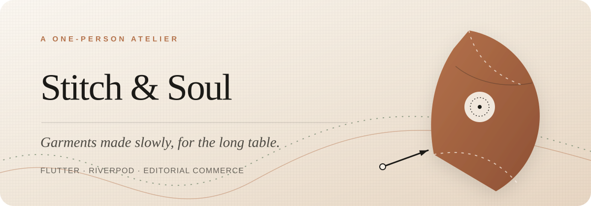
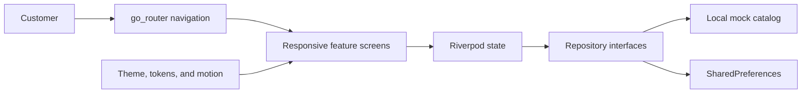

<div align="center">
  

  <h1>Stitch & Soul</h1>

  <p><strong>Garments made slowly, for the long table.</strong></p>
  <p>
    A thoughtful Flutter storefront for a one-person clothing atelier—designed
    for ready-to-wear discovery, made-to-measure service, and calm commerce.
  </p>

  <p>
    <a href="./docs/PRD.md"><strong>Read the full product requirements →</strong></a>
  </p>

  <p>
    
    
    
    
  </p>
</div>



## About Stitch & Soul

Stitch & Soul turns a small independent atelier into a complete digital storefront. Customers can discover garments, compare ready-to-wear and made-to-measure options, save favorites, record measurements, build a shopping bag, and complete a safe demonstration checkout.

The experience combines editorial composition, warm textile-inspired visuals, and practical commerce flows in one responsive Flutter application. It is web-first and remains compatible with Android and iOS.

## What Stitch & Soul includes

| Experience | What it does | Customer outcome |
| --- | --- | --- |
| **Collection discovery** | Presents 13 garments across dresses, tops, bottoms, outerwear, and occasionwear. | Easier browsing and comparison |
| **Product details** | Explains fabric, care, stock, colors, sizing, lead times, and related garments. | More confident decisions |
| **Made to measure** | Guides customers through measurements, units, fit preferences, notes, consent, and review. | A clearer custom-order path |
| **Shopping flow** | Supports favorites, cart editing, promotions, shipping, tax estimates, and simulated checkout. | A complete storefront journey |

## Storefront experiences

The application includes focused, connected routes for the complete customer journey:

- **Editorial home** — introduces the atelier, featured pieces, collections, and services.
- **Shop and categories** — combines search, availability and price filters, sorting, and responsive product grids.
- **Garment details** — supports colors, sizes, ready-to-wear or made-to-measure selection, care guidance, and related products.
- **Measurement profile** — provides a five-step guided flow with centimeter and inch support, validation, consent, and optional local persistence.
- **Favorites and shopping bag** — keeps saved pieces available locally and calculates quantities, promotions, shipping, tax, and custom-work surcharges.
- **Demo checkout** — completes the journey without requesting or storing real payment credentials.

## How the application works



Route-level UI depends on state and repository interfaces. The current local catalog and persistence layer can therefore be replaced by production services without rebuilding the customer experience from scratch.

## Built with care

The public experience reflects four design principles:

- **Editorial clarity** — serif-led typography, generous spacing, warm material colors, and a restrained visual hierarchy.
- **Purposeful motion** — staggered reveals, soft route transitions, hover lift, animated selections, and reduced-motion support.
- **Accessible foundations** — semantic controls, keyboard-aware interactions, text scaling, and responsive layouts.
- **Safe demonstration data** — the checkout is simulated, forms transmit nothing, and no real payment details are collected.

## Technology

| Layer | Technology | Purpose |
| --- | --- | --- |
| Interface | Flutter Material | Responsive storefront and interaction design |
| State | Riverpod | Catalog filters, favorites, cart, and repositories |
| Navigation | `go_router` | URL-friendly routes and page transitions |
| Persistence | `shared_preferences` | Favorites and consented measurement profile |
| Localization | `intl` and Flutter localizations | Currency and localization-ready foundations |
| Testing | Flutter Test | Unit, widget, responsive, and shopping-flow coverage |

## Project structure

```text
stitch-and-soul-flutter/
├── lib/
│   ├── app/          # Theme, motion, tokens, brand, routing, and bootstrap
│   ├── data/         # Models, mock catalog, filtering, and repositories
│   ├── features/     # Route-level screens grouped by experience
│   ├── state/        # Cart and catalog state
│   └── widgets/      # Shared responsive, navigation, and product UI
├── test/             # Unit, widget, responsive, and smoke tests
├── web/              # Flutter web shell, metadata, icons, and favicon
├── docs/             # Product requirements and README artwork
├── pubspec.yaml      # Flutter dependencies and project metadata
└── README.md         # Project overview and setup guide
```

## Run locally

Install Flutter stable 3.27 or newer, then run:

```powershell
git clone https://github.com/Saad-WorkSpace/stitch-and-soul-flutter.git
cd stitch-and-soul-flutter
flutter pub get
flutter run -d chrome
```

For another emulator or connected device:

```powershell
flutter devices
flutter run -d <device-id>
```

## Quality checks

Run the complete local quality gate before release:

```powershell
dart format --output=none --set-exit-if-changed lib test
flutter analyze
flutter test
flutter build web --release
```

The current release is verified with Flutter 3.47.0 and Dart 3.13.0. Static analysis reports no issues, all **26 automated tests pass**, and the production web build succeeds.

## Demo behavior

The repository is intentionally safe to explore as a portfolio-quality commerce demonstration:

- Product imagery uses reliable local textile-style placeholders.
- Contact and newsletter forms show local confirmation but transmit nothing.
- Favorites and a consented measurement profile can persist locally.
- Inventory, shipping, tax, email, analytics, and payment services are simulated.
- Promo codes `WELCOME10`, `ATELIER15`, and `FREESHIP` can be used during checkout.

> [!CAUTION]
> Connect an audited hosted checkout before accepting real orders. Never collect raw payment credentials directly in this Flutter client or commit private service keys to the repository.

## Explore Stitch & Soul

Read the product requirements for the complete vision, customer journeys, design direction, architecture, acceptance criteria, and production roadmap:

### [Open the Stitch & Soul PRD →](./docs/PRD.md)
