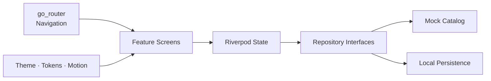

<p align="center">
  
</p>

<p align="center">
  <strong>An editorial Flutter storefront for a one-person clothing atelier.</strong><br />
  Ready-to-wear, made-to-measure, and a shopping experience designed with care.
</p>

<p align="center">
  
  
  
  
</p>

<p align="center">
  <a href="#-the-experience">Experience</a> ·
  <a href="#-quick-start">Quick start</a> ·
  <a href="#-architecture">Architecture</a> ·
  <a href="#-quality">Quality</a> ·
  <a href="docs/PRD.md">Full PRD</a>
</p>

---

## ✦ The experience

Stitch & Soul turns a small atelier into a complete digital storefront. It combines calm editorial composition, tactile textile-inspired visuals, and practical commerce flows without depending on a live backend or remote image service.

| Discover | Personalize | Purchase |
| :--- | :--- | :--- |
| Browse 13 garments across five collections | Choose ready-to-wear or made-to-measure | Manage quantities, promos, shipping, and tax |
| Search, filter, sort, and save favorites | Complete a guided five-step measurement profile | Walk through a safe, simulated checkout |
| Explore story, craft, services, and care | Switch between centimeters and inches | Receive a polished mock order confirmation |

### Made to feel considered

- **Editorial by design** — serif-led typography, generous whitespace, warm material colors, and handcrafted placeholder artwork.
- **Motion with purpose** — staggered reveals, gradient orbs, hover lift, animated selections, and soft route transitions inspired by React Bits.
- **Responsive everywhere** — layouts adapt from compact mobile screens to wide desktop canvases.
- **Accessible foundations** — semantic controls, keyboard-aware interactions, visible hierarchy, and reduced-motion support.
- **Local-first demo data** — favorites and consented measurements use local persistence; products remain dependable without a network.

> [!NOTE]
> This is a portfolio-quality commerce demo. Contact forms, newsletter signup, inventory, shipping quotes, tax calculation, and checkout are simulated. The app never requests or stores real payment credentials.

## 🧵 Feature tour

<table>
  <tr>
    <td width="33%" valign="top">
      <h3>Collection</h3>
      <p>Category routes, text search, availability and price filters, sorting, related garments, stock, fabric, care, and lead-time details.</p>
    </td>
    <td width="33%" valign="top">
      <h3>Atelier</h3>
      <p>A guided measurement wizard with unit conversion, validation, fit preferences, notes, consent, review, and cart attachment.</p>
    </td>
    <td width="33%" valign="top">
      <h3>Commerce</h3>
      <p>Favorites, cart editing, a 25% made-to-measure surcharge, demo promo codes, shipping thresholds, tax estimates, and receipt flow.</p>
    </td>
  </tr>
</table>

## 🚀 Quick start

### Requirements

- Flutter stable **3.27+**
- Dart (included with Flutter)
- Chrome or Edge for web development
- The **Flutter** and **Dart** VS Code extensions

This repository is verified with **Flutter 3.47.0** and **Dart 3.13.0**.

```powershell
git clone https://github.com/Saad-WorkSpace/stitch-and-soul-flutter.git
cd stitch-and-soul-flutter
flutter pub get
flutter run -d chrome
```

For another emulator or connected device:

```powershell
flutter devices
flutter run -d <device-id>
```

## 🏛 Architecture

The application uses a small feature-first architecture. UI depends on state and repository interfaces, keeping today’s mock catalog replaceable with a production API later.



```text
lib/
├── app/          theme, motion, tokens, brand, routing, bootstrap
├── data/         models, mock catalog, filtering, repositories
├── features/     route-level screens grouped by experience
├── state/        cart and catalog state
└── widgets/      shared responsive, navigation, and product UI
```

### Core stack

| Layer | Technology | Responsibility |
| :--- | :--- | :--- |
| UI | Flutter Material | Responsive storefront and interaction design |
| State | Riverpod | Cart, catalog filters, favorites, and local repositories |
| Navigation | `go_router` | URL-friendly routes and transitions |
| Persistence | `shared_preferences` | Favorites and consented measurement profile |
| Localization | `intl` + Flutter localizations | Currency and localization-ready foundations |

## 🗺 Routes

| Route | Experience | Route | Experience |
| :--- | :--- | :--- | :--- |
| `/` | Editorial home | `/services` | Services and alterations |
| `/shop` | Full collection | `/story` | Atelier story |
| `/shop/category/:category` | Category collection | `/contact` | Consultation form demo |
| `/product/:slug` | Garment details | `/favorites` | Saved garments |
| `/measurements/new` | Measurement wizard | `/cart` | Shopping bag |
| `/checkout` | Simulated checkout | `/checkout/success` | Mock receipt |

## ✅ Quality

Every release can be checked with the same four-command gate:

```powershell
dart format --output=none --set-exit-if-changed lib test
flutter analyze
flutter test
flutter build web --release
```

| Check | Latest result |
| :--- | :--- |
| Dart formatting | Clean |
| Flutter analysis | No issues found |
| Automated tests | **26 passing** |
| Production web build | Successful |
| WebAssembly dry run | Successful |

The suite covers catalog filtering, safe result limits, cart quantities and totals, promotions, measurement validation, responsive layout behavior, and the home-to-product shopping path.

## 🎟 Demo details

Try the checkout flow with any of these local-only promotion codes:

| Code | Effect |
| :--- | :--- |
| `WELCOME10` | 10% off |
| `ATELIER15` | 15% off |
| `FREESHIP` | Free shipping |

No backend, authentication service, inventory API, email provider, analytics platform, or payment processor is connected. Product imagery intentionally uses local textile-style placeholders until licensed photography is supplied.

## 🌱 Production roadmap

- Replace placeholders with optimized, licensed product photography.
- Connect catalog, inventory, customer, order, shipping, tax, and CMS services behind the existing repository interfaces.
- Add an audited hosted checkout instead of collecting raw payment information in the Flutter client.
- Add localization, currencies, consent management, analytics, and error reporting.
- Complete real-device accessibility testing at mobile, tablet, and desktop breakpoints.
- Configure hosting rewrites so deep links return `index.html`.

---

<p align="center">
  <strong>Stitch & Soul</strong><br />
  <em>Garments made slowly, for the long table.</em><br /><br />
  <a href="docs/PRD.md">Read the product requirements →</a>
</p>
